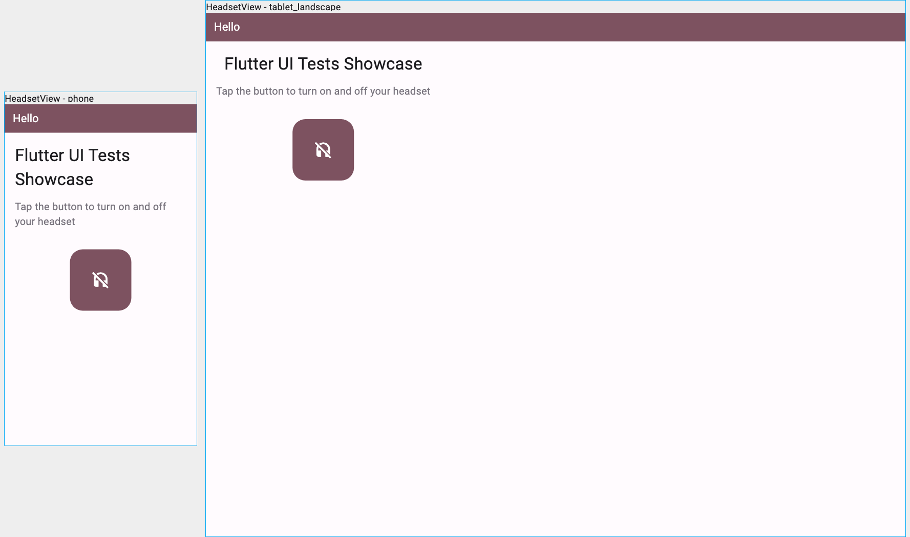

### @flutter_ui_test


<br><br>

Flutter UI tests showcase using `golden_toolkit`, `Finder API` and integration tests (E2E).

### About

UI tests are extremely important to guarantee the high quality of our interfaces
for providing a better user experience throughout the application. For achieving this
we can simply use the following approaches:

- UI Regression tests with Golden testing using `golden_toolkit`
- Widget tests using `Finder` API provided by Flutter framework
- Integration tests using `integration_tests` also called E2E testing

### Execute Tests

Execute widget and golden tests

```bash
flutter test
```

To update the generated golden files, just run:

```bash
flutter test --update-goldens
```

To run the integration tests, open an emulator and runs:

```bash
flutter test integration_test
```
